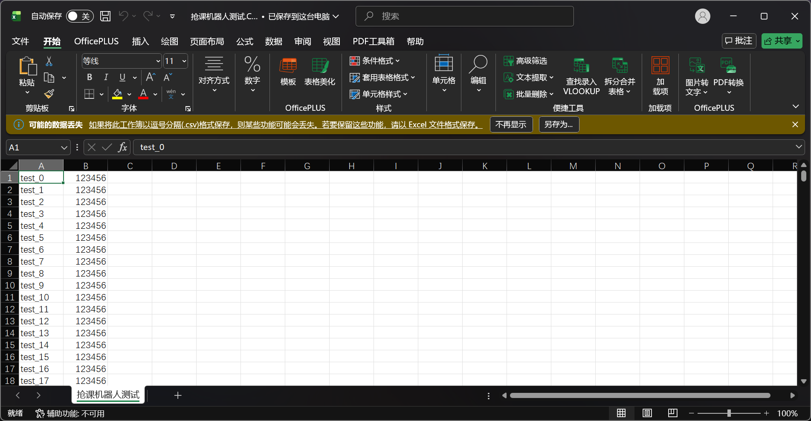
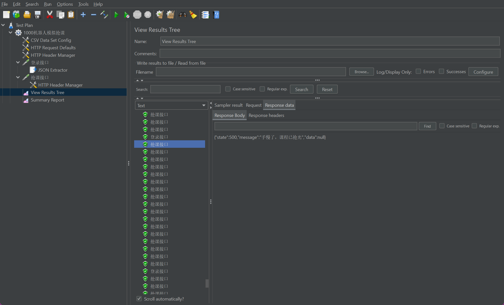
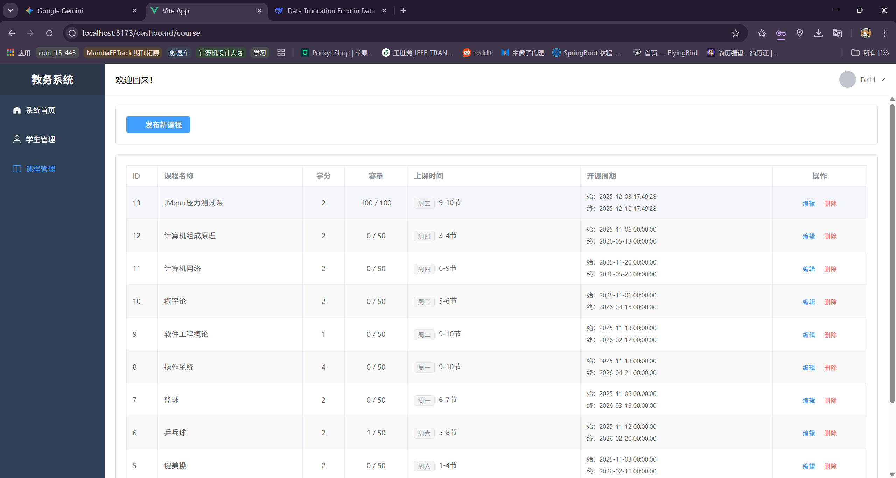
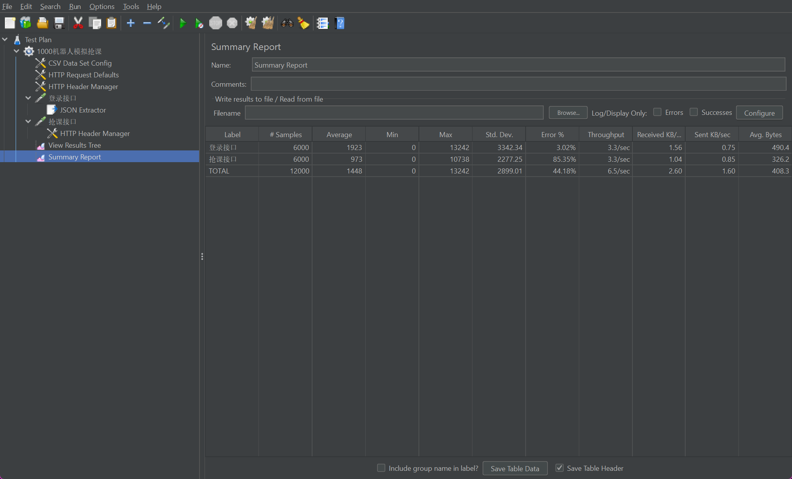

# 高并发教务选课系统

    

> 基于 Spring Boot + Vue 3 的前后端分离教务系统，核心实现了一套 **抗压、防重、异步削峰** 的高并发抢课解决方案。

## 🏗️ 系统架构

* **前端**：Vue 3 + Vite + Element Plus + Axios 拦截器 + 动态路由
* **后端**：Spring Boot + MyBatis + Spring Security (RBAC模型)
* **中间件**：Redis (缓存/分布式锁) + RabbitMQ (消息队列) + MySQL
* **部署**：Docker 容器化部署(暂时没做)

## 🌟 核心技术

### 1. 高并发抢课
* **Redis 预减库存**：利用 `Atomic Decrement` 预扣库存，拦截 99% 的无效流量请求数据库，防止数据库宕机。
* **Redis Set 防重**：利用 `sIsMember` 实现 O(1) 复杂度的重复选课拦截，防止同一用户重复抢单。
* **RabbitMQ 削峰填谷**：将选课请求异步化，前端实现“排队中”轮询机制，后端通过 MQ 监听器慢慢消费，保证数据最终一致性。
* **JMeter 压测**：在 1000 并发下，数据库零死锁，无超卖，QPS 提升 50 倍。

### 2. 安全与认证
* **JWT 无状态认证**：基于 Token 的身份验证，自定义拦截器解析 Token。
* **动态权限控制**：基于角色的访问控制 (RBAC)，管理员与学生权限严格隔离。
* **数据安全**：全站密码采用 BCrypt 强哈希加密。

### 3. 数据一致性
* **事务保障**：使用 `@Transactional` 确保 Redis 回滚与数据库回滚同步。
* **库存回补**：设计了完整的补偿机制，当数据库写入失败时，自动回滚 Redis 库存。

## 项目演示






## 依赖安装

* JDK 17+
* Node.js 16+
* MySQL 8.0
* Redis & RabbitMQ (推荐 Docker 部署)

### 2. 启动后端
```bash
git clone [https://github.com/yourname/course-system.git](https://github.com/yourname/course-system.git)
cd newpt
mvn clean install
# 记得修改 application.yml 里的数据库密码
java -jar target/app.jar
```

启动前端
```bash
cd newpt_ui
npm install
npm run dev
```

## 若有做的不妥的地方，还请不吝指正