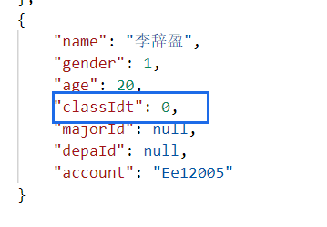
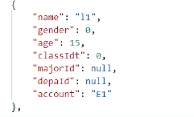
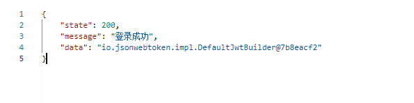

关系模型：
学生（学号，姓名，性别，年龄，入学年份，班号）
班级（班号，专业号）== 班级名用专业号查询的专业+班号组成
专业（专业号，专业名）
系（系号，系名）
老师（职工号，姓名，性别，年龄，学历，职称，入职时间）
课程（课程号，课程名，时间，学时，学分，授课教师工号） == 根据工号再查询授课老师名


```bash
mysql> CREATE DATABASE IF NOT EXISTS newpt_db
    -> CHARACTER SET utf8mb4
    -> COLLATE utf8mb4_unicode_ci;
Query OK, 1 row affected (0.08 sec)

mysql> CREATE USER 'newpt_user'@'%' IDENTIFIED BY '123123';
Query OK, 0 rows affected (0.05 sec)

mysql> GRANT ALL PRIVILEGES ON newpt_db.* TO 'newpt_user'@'%';
Query OK, 0 rows affected (0.01 sec)

mysql> SHOW GRANTS FOR 'newpt_user'@'%';
+----------------------------------------------------------+
| Grants for newpt_user@%                                  |
+----------------------------------------------------------+
| GRANT USAGE ON *.* TO `newpt_user`@`%`                   |
| GRANT ALL PRIVILEGES ON `newpt_db`.* TO `newpt_user`@`%` |
+----------------------------------------------------------+
2 rows in set (0.01 sec)

mysql> use newpt_db;
Database changed
```
```mysql
show databases;

-- 创建系信息表
create table department (
    id varchar(1) primary key comment '系号',
    name varchar(10) not null comment '系名'
) comment '系信息表';

-- 创建专业表
create table major (
    id varchar(1) primary key comment '专业号',
    name varchar(10) not null comment '专业名'
) comment '专业信息表';

-- 创建班级表
create table class (
    idt int not null auto_increment primary key,
    id varchar(1) not null comment '几班',
    name varchar(10) not null comment '专业号'
) comment '班级信息';

-- 学生表
create table stu (
    id int primary key auto_increment comment 'id自增，id组成学号',
    name varchar(5) not null comment '姓名',
    gender int not null comment '性别，男1女0',
    age tinyint unsigned comment '年龄',
    year year not null comment '入学年份',
    class_idt int not null comment '根据idt寻找班级',
    major_id varchar(1) not null comment '系号',
    depa_id varchar(1) not null comment '专业号'
) comment '学生信息表';

-- 创建教师表
create table tea (
    id int primary key auto_increment comment 'id自增，id组成工号',
    name varchar(5) not null comment '姓名',
    gender int not null comment '性别，男1女0',
    age tinyint unsigned comment '年龄',
    edu varchar(20) comment '学历',
    title varchar(20) comment '职称',
    hire_date date not null comment '入职时间'
) comment '教师信息表';

-- 创建课程表
CREATE TABLE `course` (
                          `id` int NOT NULL AUTO_INCREMENT,
                          `name` varchar(50) NOT NULL COMMENT '课程名称',
                          `teacher_id` int DEFAULT NULL COMMENT '授课教师ID (关联tea表)',
                          `score` int DEFAULT '2' COMMENT '学分',
                          `capacity` int DEFAULT '50' COMMENT '最大容量 (比如这门课只招50人)',
                          `selected_num` int DEFAULT '0' COMMENT '已选人数 (关键字段！乐观锁要用)',
                          `version` int DEFAULT '0' COMMENT '乐观锁版本号 (后面优化要用)',
                          PRIMARY KEY (`id`),
                          UNIQUE KEY `uk_name` (`name`) -- 课程名不能重复
) ENGINE=InnoDB DEFAULT CHARSET=utf8mb4;

ALTER TABLE course
    ADD COLUMN week_day VARCHAR(10) COMMENT '上课时间-周几 (例如: 3 代表周三)',
    ADD COLUMN section_time VARCHAR(20) COMMENT '上课时间-节次 (例如: 5-6 代表第5、6节)';

CREATE TABLE `student_course` (
                                  `id` int NOT NULL AUTO_INCREMENT,
                                  `student_id` int NOT NULL COMMENT '学生ID (关联 stu 表)',
                                  `course_id` int NOT NULL COMMENT '课程ID (关联 course 表)',
                                  `create_time` datetime DEFAULT CURRENT_TIMESTAMP COMMENT '选课时间',
                                  PRIMARY KEY (`id`),

    -- (关键) 唯一索引：防止同一个学生重复选同一门课
                                  UNIQUE KEY `uk_stu_course` (`student_id`, `course_id`)
) ENGINE=InnoDB DEFAULT CHARSET=utf8mb4;

-- 2. 添加选课时间窗口
ALTER TABLE course
    ADD COLUMN start_time DATETIME COMMENT '选课开始时间',
    ADD COLUMN end_time DATETIME COMMENT '选课结束时间';


alter table stu
add column account varchar(10) comment '账户（学号）',
add column password varchar(10) not null comment '密码';


alter table tea
modify column hire_date year not null comment '入职时间',
add column account varchar(10) comment '账户（工号）',
add column password varchar(10) not null comment '密码';

create table admin (
id int primary key comment '管理员id',
account varchar(10) comment '账户',
password varchar(10) comment '密码'
) comment '管理员';

ALTER TABLE admin MODIFY COLUMN id INT;
ALTER TABLE admin DROP PRIMARY KEY;
ALTER TABLE admin MODIFY COLUMN id INT AUTO_INCREMENT PRIMARY KEY;

insert into admin (account, password)
values ('admin', '000000');

alter table stu
ADD COLUMN role VARCHAR(20) NOT NULL DEFAULT 'ROLE_STUDENT';

alter table tea
ADD COLUMN role VARCHAR(20) NOT NULL DEFAULT 'ROLE_TEACHER';

alter table admin
ADD COLUMN role VARCHAR(20) NOT NULL DEFAULT 'ROLE_ADMIN';

alter table stu
    add constraint stu_pk
        unique (account);
```

---

mapper:
本来单独想写一个注册mapper接口，但是这应该是管理员才有的权限，所以学生和教师，就只有登录接口就行了
登录是业务逻辑，不在mapper考虑范围内

pagehelper：分页查询，配合mybatis和vue进行查询

---
关键：从这个项目，从一个小白，考虑到全栈，从骨架能开发出项目，到安全开发一个项目，到多用户实践，再到精进开发技术


---

"classIdt": 0 (这是“元凶”！)
这个不是数据问题，这是一个代码规范问题。
原因： 我 100% 敢肯定，StuVO.java 和 Stu.java (实体类) 这两个文件里，classIdt 字段的类型都是小写的 int。
流程：
在数据库 stu 表中，“李辞盈”的 class_idt 字段，存储的值也是 NULL。
MyBatis 从数据库读出 NULL。
MyBatis 尝试把 NULL 赋值给 Stu 实体 (Entity) 的 classIdt 字段。
(关键点！) Java 的基本类型 int 不能为 null！
Java 别无选择，只能强制给了它一个默认值：0。
BeanUtils 把这个 0 拷贝给了 StuVO。
Jackson 把它转成 JSON ("classIdt": 0)。
---

打开mybatis的驼峰映射就行
``` xml
mybatis:
type-aliases-package: package com.cy.newpt.pojo.entity
mapper-locations: classpath:mapper/*.xml
configuration:
map-underscore-to-camel-case: true
```

这不是token，而是生成toekn的制造商，编号@7b8eacf2
原因在这
```java
public String generateToken(String account, Role role) {
        // 1. 创建一个“claims”声明，这是token的“有效载荷”
        Map<String, Object> claims = new HashMap<>();
        // 2. 可以把任何非敏感信息放进去，比如角色
        claims.put("role", role);

        // 3. 使用Jwt.builder() 来构建token
        return Jwts.builder()
                .claims(claims) // 自定义声明
                .subject(account)
                .issuedAt(new Date(System.currentTimeMillis())) // 初始时间
                .expiration(new Date(System.currentTimeMillis() + expirationMs)) // 结束日期
                .signWith(getSigningKey())
                .toString();
    }
```
这个toString()方法:
Jwts.builder().toString()
作用： 这是一个 Java 默认的方法，它只会返回这个“Builder 对象”在内存中的“描述”（你看到的 io.jsonwebtoken.impl.DefaultJwtBuilder@7b8eacf2）。
比喻： 你在问“造币厂的机器”：“你是什么？” 它回答：“我是一台造币机，我的编号是 @7b8eacf2”。
结果： 你拿到了“机器的描述”，不是“硬币” (Token)！

Jwts.builder().compact()
作用： 这是 jjwt 库的专属方法，它会执行签名和压缩，生成最终的 Token 字符串。
比喻： 你在对“造币厂的机器”说：“开始工作！把硬币压出来！”
结果： 你拿到了“硬币” (那串 eyJ... 的 Token)。


---
